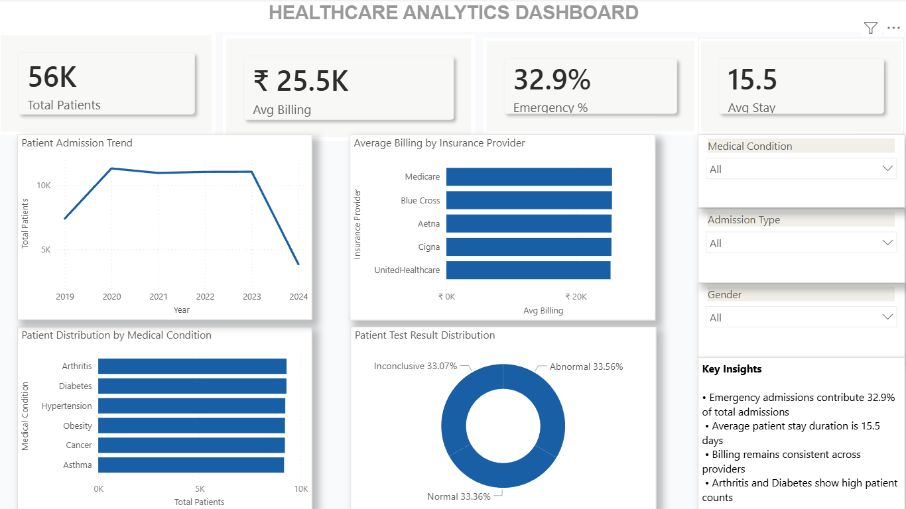

# Healthcare Analytics Dashboard

## Project Overview
This project is an end-to-end Healthcare Analytics solution built using Power BI, SQL, and Python to analyze patient admissions, billing trends, insurance providers, and clinical insights.

---

## Tech Stack
- Power BI
- SQL
- Python
- DAX
- Power Query
- CSV Dataset

---

## Project Workflow

### 1. Data Cleaning & Preparation
- Cleaned healthcare dataset using Python and Power Query
- Handled preprocessing and formatting

### 2. SQL Analysis
- Performed data querying and analysis using SQL
- Used filtering, grouping, and aggregations

### 3. Dashboard Development
- Built an interactive Power BI dashboard
- Created KPI cards, trend analysis, slicers, and insights

---

## Dashboard Features
- KPI Monitoring
- Admission Trend Analysis
- Billing Insights
- Insurance Provider Analysis
- Interactive Slicers
- Clinical Insights

---

## Key Insights
- Emergency admissions contribute 32.9% of total admissions
- Average patient stay duration is 15.5 days
- Billing remains relatively stable across insurance providers
- Arthritis and Diabetes show high patient counts

---

## Dashboard Preview

---

## Files Included
- Power BI Dashboard (.pbix)
- SQL Queries (.sql)
- Jupyter Notebook Analysis (.ipynb)
- Dataset (.csv)
- Dashboard Screenshot (.png)
